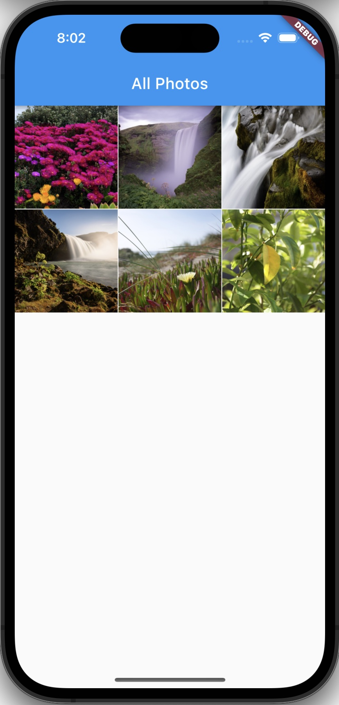
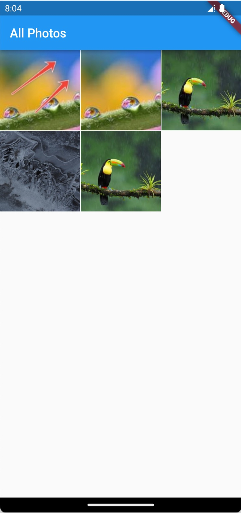

<!-- Copyright 2023 Annotium. All rights reserved. -->

# photos_native

A Flutter native plugin for photo library. 

## 1. Getting Started

`photos_native` is high performance, yet easy to use photo library plugin, working on Android and iOS. It can load albums, load image/thumnail, save, share... photo images. 

| iOS                          |                Android               |
| ---------------------------- | ------------------------------------ |
|  |  |

### Install

1. With Flutter:
    ```sh
    $ flutter pub add photos_native
    ```

2. YAML

    ```yaml
    dependencies:
      photos_native: ^0.0.1
    ```

## Working with library

### Set up your project

This library depends on [flutter-permission-handler](https://pub.dev/packages/permission_handler), so you need to set up correct permission before using.
While the permissions are being requested during runtime, you'll still need to tell the OS which permissions your app might potentially use. That requires adding permission configuration to Android- and iOS-specific files.

<details>
<summary>Android</summary>

You don't need to setup anything if you target `SDK 30` or above. 

If your `compileSdkVersion`/`targetSdkVersion` is `29`, you can consider adding `android:requestLegacyExternalStorage="true"`
to your `AndroidManifest.xml` in order to obtain resources:

```xml
<manifest xmlns:android="http://schemas.android.com/apk/res/android"
    package="com.example.your_package">

    <application android:label="{appName}"
        android:icon="@mipmap/ic_launcher"
        android:requestLegacyExternalStorage="true">
    </application>
</manifest>
```

</details>  

<summary>iOS</summary>
<details>
1. Add the following to your `Podfile` file:
    ```ruby
       post_install do |installer|
         installer.pods_project.targets.each do |target|
           ... # Here are some configurations automatically generated by flutter
      
           # Start of the permission_handler configuration
           target.build_configurations.each do |config|
             config.build_settings['GCC_PREPROCESSOR_DEFINITIONS'] ||= [
               '$(inherited)',
        
               ## dart: PermissionGroup.photos
               'PERMISSION_PHOTOS=1',
             ]
      
           end 
           # End of the permission_handler configuration
         end
       end
       ```
   
2. Config plist file
 Add key `NSPhotoLibraryUsageDescription` to the the `ios/Runner/Info.plist`:
    ```plist
    <key>NSPhotoLibraryUsageDescription</key>
    <string>In order to access your photo library</string>
    ```

</details>  

## Usage
### Basic Concepts

[PHItem]() is a photo item on device, [PHItem]() has an photo ID exclusively or file URI.

[PHAlbum]() is abstract version of `MediaStore` bucket on Android, or `PHAssetCollection` on iOS. [PHAlbum]() can contains multiple [PHItem]()s.

[PHGallery]() contains all photo albums on the device.

Default album is `All Photos` which contains all photos in gallery (user can select any name to default albums)

[PHImageDescription]() is a image descriptor, [PHImageDescription]() contain pixel bytes, width and height of the image.

### Request permission

Request permission for photo library

```dart
await PhotosNative.requestPermissions();
```

### Get photo gallery


```dart
    final gallery = await PhotosNative.loadGallery(title: 'All Photos');
```

See [PHGallery]() for more details

### Get thumnail

Return photo thumnail image descriptor

```dart
    final descriptor = await PhotosNative.getThumbnail(200, 200, 'id');

    // or load from uri

    final descriptor = await PhotosNative.getThumbnail(200, 200, 'image uri');
```

See class [PHImageDescription]() for more details

### 1.4 Get photo image descriptor

Return photo image descriptor
    
```dart
    final descriptor = await PhotosNative.getPixels('photo_id');
```

See class [PHImageDescription] for more details

### Delete images

Return the number of deleted images
```dart
    await PhotosNative.delete(['photo_id', 'photo_id2']);
```

### Save image

Save image to a path/directory ...

```dart
    await PhotosNative.save(bytes, width, height, path: path);
```

### Share image

Share image with other apps

```dart
    await PhotosNative.share(bytes, width, height, devicePixelRatio);
```

## Experiment

Working with Flutter backend texture. Read [Flutter Texture](https://api.flutter.dev/flutter/widgets/Texture-class.html) for more details. You can experiment these features to check if it can improve your app performance.

### Load image texture

```dart
    int textureId = await PhotosNative.acquireTexture(id, width, height);

    // usage
    Container(child: Texture(textureId: textureId));
```

### Release image texture

```dart
    await PhotosNative.releaseTexture(id);
```